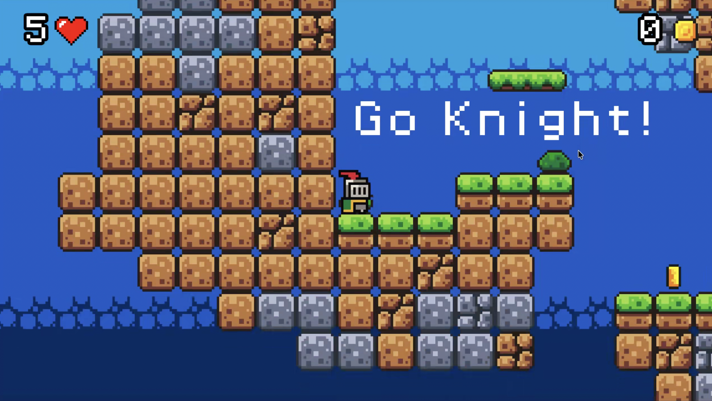
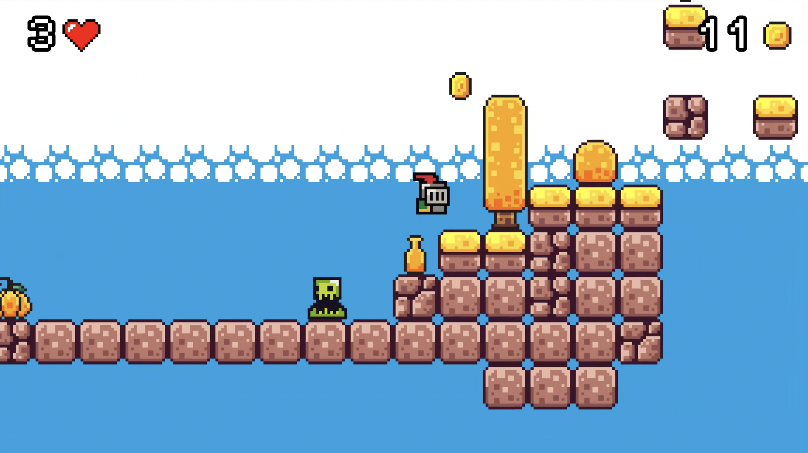
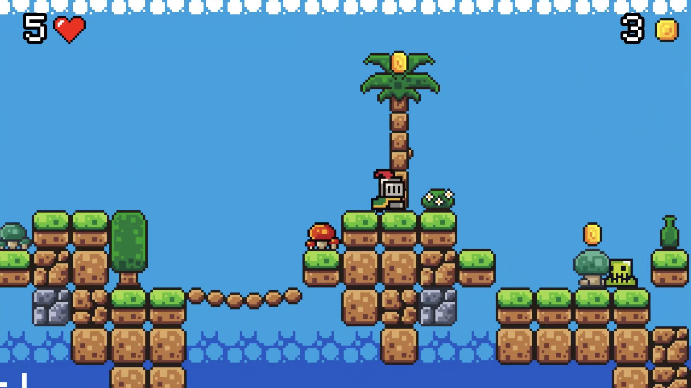
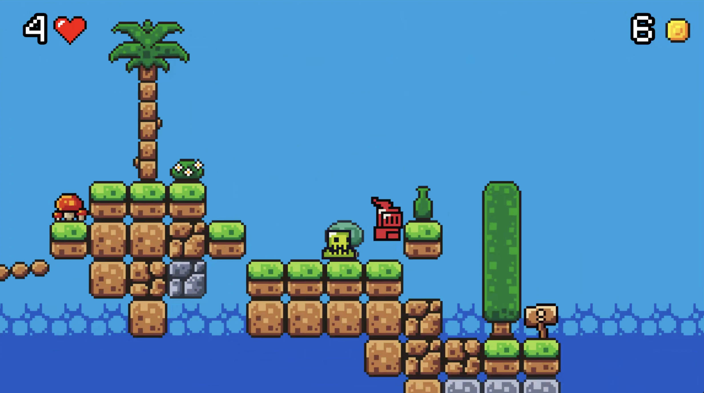

# **Jumping Knight**

This is a hobby game in 2D I have made following a tutorial, using Godot Engine and C#.

This game implements basic physics of jumping, gravity, moving forward and back, as well as friction, along with obstacles in the path implementing collisions.

I have implemented a point based system where the knight has to collect coins to increase his score.

There are a few slimes (monsters) in this game who change their direction if they detect an obstacle in front of them. If the knight touches these slimes, the knight takes damage.

